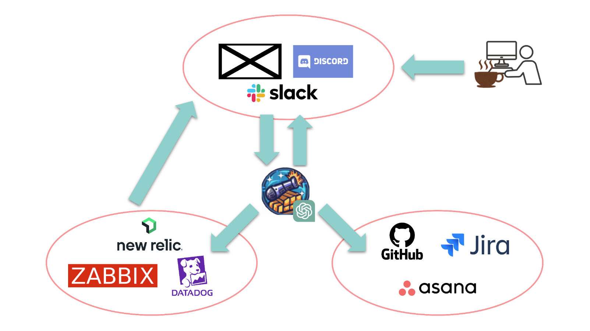

# Error Defense

## Overview

Error Defense is an open-source software designed to bridge error tracking systems and error information accumulation systems using a Least Load Method (LLM). The tool is primarily written in Python and can be used to improve productivity in development environments by allowing individuals to deploy in their own environments using a configuration file.



## Features

- Simplified error tracking: Collect and centralize error data from multiple sources.
- Least Load Method (LLM): Efficiently handles the distribution of error information.
- Deployment flexibility: Enables deployment in individual environments using a configuration file.

## Getting Started

Here's how you can get the Error Defense system up and running.

### Prerequisites

- Python 3.9 or higher
- Serverless framework

### Setup

1. Clone this repository to your local machine:


2. Change into the `error-defense` directory:

    ```bash
    cd error-defense
    ```

3. Install the necessary dependencies:

    ```bash
    pip install -r requirements.txt
    ```

4. Setup environment

    ```bash
    cp .env-sample .env

    # Fill Environment Values
    ```

### Usage

To start the Error Defense system, deploy via Serverless Framework:

```bash
serverless deploy
```

This will start Error Defense in your AWS account.

## License
This project is licensed under the MIT License - see the [LICENSE](./LICENSE) file for details.

## Contribution
Please read [CONTRIBUTING.md](./CONTRIBUTING.md) for details on how to contribute to this project.

## Support
If you have any questions or run into issues, please open an issue in this repository.

## Acknowledgements
Thanks to everyone who contributes to this project and utilizes it in their development processes.


I hope this helps!
